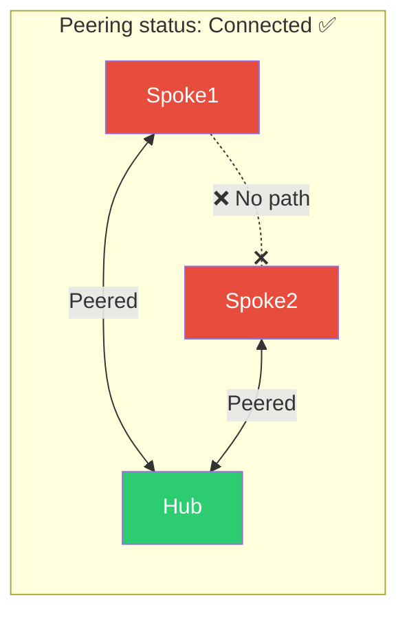
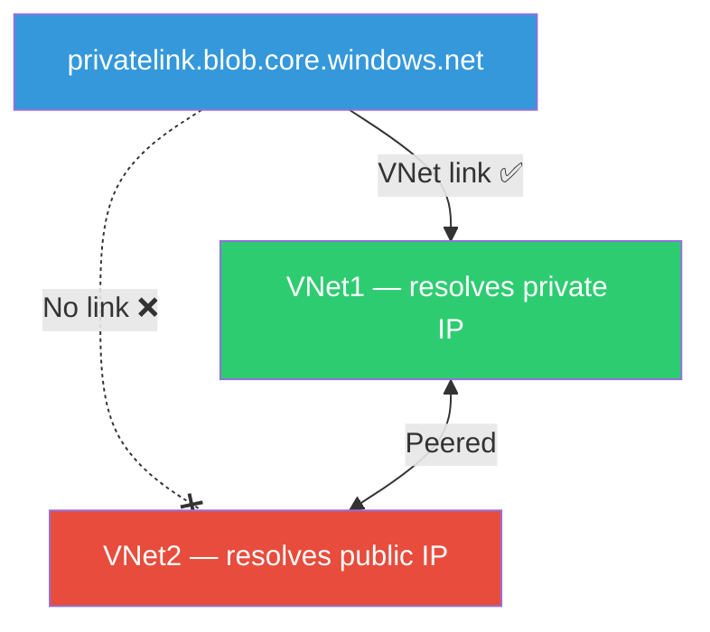
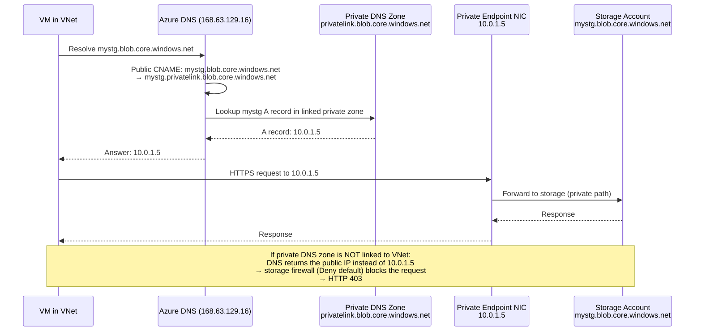
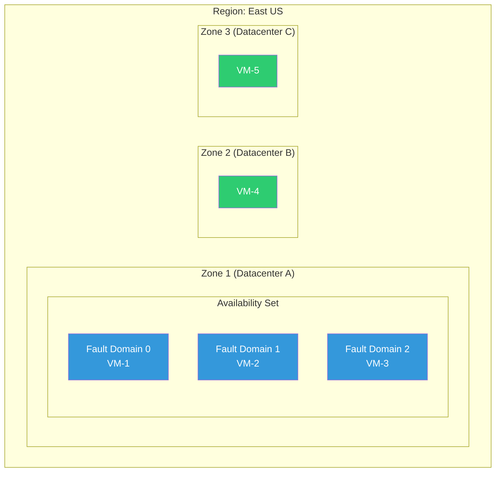
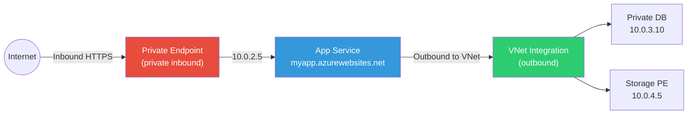
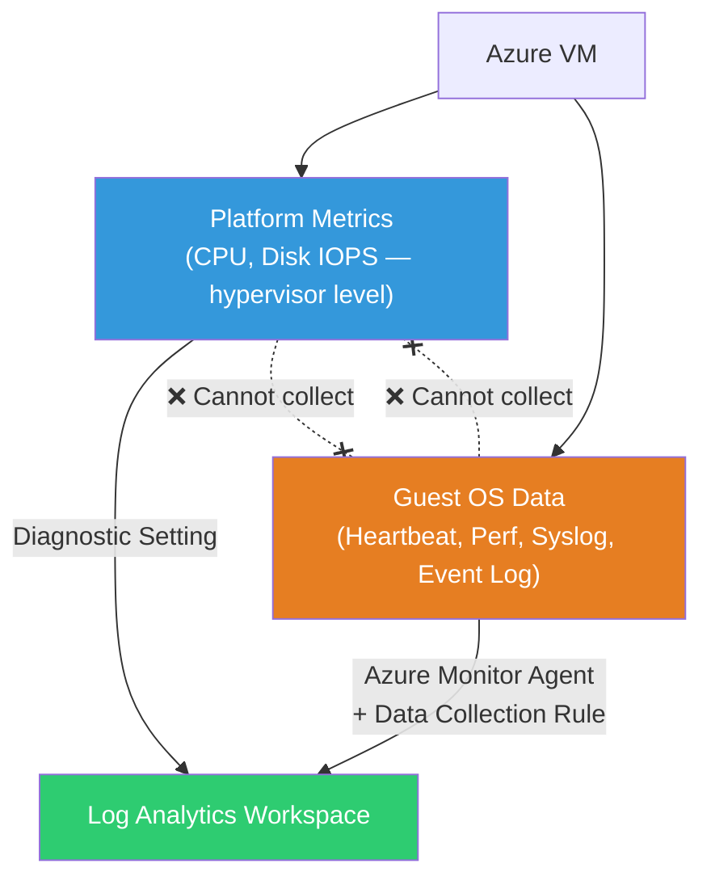
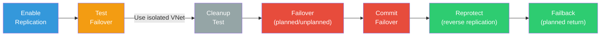

# AZ-104 exam traps and misconceptions cheat sheet

Use this alongside [11 — Last-week revision handbook](11-last-week-revision.md). That file covers decision logic and comparisons. This file covers **what the exam expects you to confuse** — the specific wording traps, visual mental models, and comparison tables that are not in the revision handbook.

Read this the day before the exam. For every trap listed, you should be able to say "I know why the wrong answer looks right" without checking anything.

---

## How to use this file

- **⚠️ Trap** = the specific misconception the exam exploits
- **✅ Truth** = the correct mental model in one sentence
- **🔑 Proof** = the fastest CLI/Portal evidence to verify

---

## Identity and governance traps

### Trap 1 — "Reader can read everything"

- ⚠️ **Trap:** Reader on a storage account should let you read blobs.
- ✅ **Truth:** Reader is a management-plane role. It reads account properties, not blob data. You need `Storage Blob Data Reader` (a data-plane role) to read private blob contents.
- 🔑 **Proof:** `az role definition list --name Reader --query '[].permissions[].notDataActions'` — shows no data actions at all.

### Trap 2 — "Owner bypasses Azure Policy"

- ⚠️ **Trap:** Owner at subscription scope can deploy anything.
- ✅ **Truth:** Azure Policy operates at the ARM request layer and applies to every principal, including Owner. Only exemptions/exclusions bypass Policy.
- 🔑 **Proof:** Attempt to deploy a noncompliant resource as Owner — the request is denied with a Policy error.

### Trap 3 — "Tags on a resource group propagate to its resources"

- ⚠️ **Trap:** Applying `env=prod` to a resource group means all resources inside automatically get it.
- ✅ **Truth:** Tags do NOT inherit. Resources have independent tag sets. Use Azure Policy (`modify` effect) or automation to propagate tags.
- 🔑 **Proof:** `az tag list --resource-id <resource-id>` — shows only tags directly on that resource, not parent tags.

### Trap 4 — "Budget at 100% stops your resources"

- ⚠️ **Trap:** When a budget reaches 100%, Azure automatically shuts down VMs.
- ✅ **Truth:** Budgets send notifications and trigger configured actions (Azure Function, Logic App). They do NOT automatically stop, delete, or cap any resource. The function must contain explicit logic.
- 🔑 **Proof:** Budget action group configuration — no built-in "stop VMs" action exists in the budget itself.

### Trap 5 — "CanNotDelete prevents all changes"

- ⚠️ **Trap:** CanNotDelete lock prevents any modification.
- ✅ **Truth:** CanNotDelete only prevents deletion. ReadOnly prevents all writes AND deletion. The scenario wording matters: "prevent changes" → ReadOnly. "Prevent accidental deletion" → CanNotDelete.
- 🔑 **Proof:** Apply CanNotDelete → update a tag → succeeds. Apply ReadOnly → update a tag → blocked.

| Lock Type | Blocks Deletion | Blocks Updates | Blocks Read |
|:---|:---|:---|:---|
| CanNotDelete | ✅ Yes | ❌ No | ❌ No |
| ReadOnly | ✅ Yes | ✅ Yes | ❌ No |

### Trap 6 — "Global Administrator = subscription Owner"

- ⚠️ **Trap:** Entra Global Administrator can manage Azure resources.
- ✅ **Truth:** Entra roles and Azure RBAC are separate systems. Global Admin has no Azure RBAC assignments by default. An explicit "elevate access" toggle or role assignment is needed.
- 🔑 **Proof:** `az role assignment list --assignee <global-admin-id> --all` — empty unless explicitly assigned.

---

## Storage traps

### Trap 7 — "Service endpoint = private IP"

- ⚠️ **Trap:** Enabling a service endpoint gives Storage a private IP in your VNet.
- ✅ **Truth:** Service endpoints route traffic over the Azure backbone but the storage account still uses its public IP. A **private endpoint** gives the account a private IP in your VNet.

| Feature | Traffic Path | Storage IP from Client | DNS Resolution | Requires |
|:---|:---|:---|:---|:---|
| Service endpoint | Azure backbone | Public IP | Public FQDN → public IP | Endpoint on subnet + VNet rule in storage firewall |
| Private endpoint | Through VNet NIC | Private IP (10.x.x.x) | FQDN → private IP via private DNS zone | PE NIC + approved connection + private DNS zone linked |

### Trap 8 — "SAS start time = now"

- ⚠️ **Trap:** Setting a SAS start time to "right now" (current local time) is safe.
- ✅ **Truth:** SAS tokens are validated against UTC. Clock skew between your workstation and Azure can cause "SAS not yet valid" errors. Best practice: set start time to 5–15 minutes in the past, or omit it entirely.
- 🔑 **Proof:** `date -u` vs local time — if your clock is ahead of UTC, the SAS is rejected.

### Trap 9 — "Object replication = backup"

- ⚠️ **Trap:** Object replication to another account protects against data loss.
- ✅ **Truth:** Object replication is asynchronous and replicates deletions too. It is NOT a backup. It also requires blob versioning on both accounts as a prerequisite.
- 🔑 **Proof:** Delete a blob in source → it is eventually deleted in destination too.

### Trap 10 — "Rotating key1 while apps use key1 is fine"

- ⚠️ **Trap:** Regenerating the active key is a normal rotation step.
- ✅ **Truth:** Rotate the **unused** key first. Migrate all clients to the newly rotated key. Validate. Then rotate the formerly active key. Never rotate the key that live applications are currently using.

```text
Safe rotation sequence:
  1. Apps use key1 (active)
  2. Regenerate key2 (unused) → key2 is now fresh
  3. Update all apps to use key2 → validate
  4. Regenerate key1 (now unused) → key1 is fresh for next rotation
```

---

## Networking traps

### Trap 11 — "NSG: specific rule always beats broad rule"

- ⚠️ **Trap:** An Allow rule for TCP 443 should override a Deny-All rule.
- ✅ **Truth:** NSG rules are evaluated strictly by **priority number** (lowest number first). A Deny-All at priority 100 beats an Allow-HTTPS at priority 300 — even though the allow is more specific. Priority number is the ONLY tiebreaker.

```text
Priority 100: Deny * * → EVALUATES FIRST → packet denied
Priority 300: Allow TCP 443 → NEVER REACHED
```

### Trap 12 — "Peering Connected = full connectivity"

- ⚠️ **Trap:** Spoke1 and Spoke2 are both peered to Hub, both show Connected, so they can talk.
- ✅ **Truth:** VNet peering is nontransitive. Spoke1↔Hub and Spoke2↔Hub does NOT create Spoke1↔Spoke2. Traffic does not transit Hub without explicit UDR + NVA/firewall forwarding.



**Fix options:** Direct Spoke1↔Spoke2 peering, or Hub NVA with UDRs and IP forwarding on both spokes.

### Trap 13 — "Private DNS zone + peering = cross-VNet resolution"

- ⚠️ **Trap:** A private DNS zone linked to VNet1 automatically resolves from peered VNet2.
- ✅ **Truth:** Private DNS zone links are **per-VNet**. Peering shares network connectivity, not DNS zone visibility. VNet2 must have its own link to the same zone.



### Trap 14 — "NVA IP forwarding is one setting"

- ⚠️ **Trap:** Enabling IP forwarding on the NIC in Azure is sufficient for NVA routing.
- ✅ **Truth:** IP forwarding has TWO layers. Both must be enabled:

| Layer | Setting | Where |
|:---|:---|:---|
| Azure NIC | IP forwarding = enabled | NIC resource in Azure (Portal or `az network nic update --ip-forwarding true`) |
| Guest OS | IP forwarding = enabled | Inside the VM: Linux `net.ipv4.ip_forward=1` / Windows registry |

If Azure NIC IP forwarding is off → Azure drops the packet before it reaches the VM.
If Guest OS forwarding is off → the OS drops the packet even though it arrived at the NIC.

---

## Networking architecture: the complete private endpoint DNS flow

This is the single most tested visual concept on AZ-104. Understand every hop:



---

## Compute traps

### Trap 15 — "Stopped = not billed"

- ⚠️ **Trap:** The VM shows "Stopped" in the Portal, so compute billing has stopped.
- ✅ **Truth:** There are two stopped states:

| Portal Status | Azure State | Compute Billing | Cause |
|:---|:---|:---|:---|
| **Stopped** | `PowerState/stopped` | ✅ **Still charged** | Guest OS shutdown (Start menu, `shutdown -h`) |
| **Stopped (deallocated)** | `PowerState/deallocated` | ❌ Not charged | Azure Portal **Stop** button, `az vm deallocate` |

- 🔑 **Proof:** `az vm get-instance-view --query 'instanceView.statuses[].displayStatus'` — look for `deallocated` specifically.

### Trap 16 — "Temporary disk persists across maintenance"

- ⚠️ **Trap:** Data on D: (Windows) or /dev/sdb (Linux) survives VM operations.
- ✅ **Truth:** Temporary disk data is LOST on: deallocation, resize, host maintenance move, redeployment. Only OS disk and attached managed data disks persist. Never store authoritative data on the temporary disk.

### Trap 17 — "VMSS autoscale ignores the maximum"

- ⚠️ **Trap:** If a scale-out rule says +5 instances, autoscale adds exactly 5.
- ✅ **Truth:** The configured maximum is a hard ceiling. Current 6 + rule +5 = 11, but if max is 8, capacity stops at 8. Only 2 instances are added.

```text
min=2, max=8, current=6, rule=+5
  → requested: 6+5 = 11
  → actual:    min(11, max) = 8
  → instances added: 8-6 = 2
```

### Trap 18 — "Slot swap keeps connection strings with the slot"

- ⚠️ **Trap:** My production database connection string stays in production after a swap.
- ✅ **Truth:** Only settings marked as **deployment slot settings** (sticky) stay with the slot. Non-sticky settings travel with the code during swap. If you didn't mark the connection string as sticky, production now has the staging database string.

| Setting Type | During Swap |
|:---|:---|
| **Sticky** (slot setting) | Stays with the slot — production keeps production DB string |
| **Non-sticky** (default) | Travels with the code — production gets staging DB string |

### Trap 19 — "Availability set = zone protection"

- ⚠️ **Trap:** An availability set protects against zone-level failures.
- ✅ **Truth:** Availability sets distribute VMs across fault domains and update domains **within one datacenter**. They do NOT protect against datacenter-level failure. Availability ZONES distribute across separate physical datacenter locations.



- **Availability Set** (blue): protects against rack/host failure within ONE datacenter
- **Availability Zones** (green): protects against entire datacenter failure

---

## Compute architecture: App Service networking directions

Another frequently confused visual concept:



- **Private Endpoint** = inbound (clients → app): gives the app a private IP in the VNet
- **VNet Integration** = outbound (app → VNet resources): lets the app reach private databases, storage, etc.
- They are **independent features** that serve **opposite directions**

---

## Monitoring and recovery traps

### Trap 20 — "Diagnostic settings collect everything"

- ⚠️ **Trap:** Configuring diagnostic settings on a VM sends all monitoring data to Log Analytics.
- ✅ **Truth:** Platform diagnostic settings route platform metrics and Activity Log. Guest-level data (Heartbeat, Perf counters, custom logs) requires **Azure Monitor Agent + Data Collection Rule** inside the VM.



### Trap 21 — "Alert fired = notification sent"

- ⚠️ **Trap:** If the alert history shows Fired, the team must have been notified.
- ✅ **Truth:** An alert firing and a notification being sent are separate steps. If no action group is attached, or the action group receiver is misconfigured, or an alert processing rule is suppressing, the alert fires silently.

```text
Alert fires → Check action group → Check receiver → Check processing rules → Notification sent
       ↓              ↓                    ↓                   ↓
    (always)    (missing? → silent)  (wrong email?)     (suppressed?)
```

### Trap 22 — "Backup policy = VM is protected"

- ⚠️ **Trap:** Creating a backup policy in a Recovery Services vault means VMs are automatically backed up.
- ✅ **Truth:** A policy defines schedule and retention. Each VM must be **separately enrolled** (protection enabled + policy assigned). No backup jobs run until a VM is explicitly protected.
- 🔑 **Proof:** `az backup item list --vault-name <vault>` — empty if no VMs are enrolled, even if policies exist.

### Trap 23 — "Test failover is safe anywhere"

- ⚠️ **Trap:** ASR test failover is isolated — I can run it in the production VNet.
- ✅ **Truth:** Test failover creates a real VM. In a production VNet it can: register in production DNS, contact live databases, generate real traffic, conflict with source VM IPs. **Always use an isolated test VNet.**

### Trap 24 — "Recovery Services vault = Backup vault"

| Feature | Recovery Services Vault | Backup Vault |
|:---|:---|:---|
| Azure VM backup | ✅ Yes | ❌ No |
| Azure Files backup | ✅ Yes | ❌ No |
| Azure Site Recovery | ✅ Yes | ❌ No |
| Azure Disks backup | ❌ No | ✅ Yes |
| Azure Blobs backup | ❌ No | ✅ Yes |
| PostgreSQL Flex backup | ❌ No | ✅ Yes |

The datasource determines which vault type to use. They are NOT interchangeable.

---

## Recovery architecture: ASR operation flow

The exam tests the exact ordering. Memorize this flow:



- **Test failover** → always isolated VNet → cleanup after validation
- **Failover** → commit once validated → reprotect to enable reverse replication → failback
- You CANNOT failback without reprotecting first

---

## Cross-domain comparison tables

### What blocks what?

| Control | Blocks Deployment | Blocks Configuration Changes | Blocks Deletion | Blocks RBAC Assignment |
|:---|:---|:---|:---|:---|
| Azure Policy (Deny) | ✅ | ✅ (if noncompliant) | ❌ | ❌ |
| Azure Policy (Audit) | ❌ | ❌ | ❌ | ❌ |
| CanNotDelete Lock | ❌ | ❌ | ✅ | ❌ |
| ReadOnly Lock | ❌ (existing only) | ✅ | ✅ | ❌ |
| RBAC (no permission) | ✅ | ✅ | ✅ | ✅ |

### "Which service for recovery?"

| Scenario | Service | Why |
|:---|:---|:---|
| Restore a VM to yesterday's state | Azure Backup | Point-in-time recovery from recovery points |
| Keep a VM running during a region failure | Azure Site Recovery | Continuous replication + orchestrated failover |
| Restore an accidentally deleted blob | Blob soft delete | Retention-based recovery without backup |
| Restore an overwritten blob's prior version | Blob versioning | Automatic prior-state retention |
| Restore a deleted file share | Azure Files soft delete | Share-level retention |
| Restore a deleted container | Container soft delete | Container-level retention |
| Protect a managed disk independently | Backup vault (Azure Disks) | Snapshot-based disk backup |

### "Which identity approach?"

| Scenario | Approach |
|:---|:---|
| Azure-hosted app accessing blob storage | Managed identity + `Storage Blob Data Contributor` |
| External partner needs 2-hour blob read access | User delegation SAS (or service SAS if Entra not available) with short expiry, HTTPS, scoped to blob |
| On-premises app accessing Azure resources | Service principal with certificate or workload identity federation |
| Admin needs temporary access to investigate | PIM (if available) or time-limited role assignment at minimum scope |
| CI/CD pipeline deploying ARM/Bicep | Managed identity (if Azure-hosted runner) or federated workload identity |

### "Service endpoint vs private endpoint vs VNet integration"

| Feature | Direction | IP Type | DNS Change Needed | Use Case |
|:---|:---|:---|:---|:---|
| Service endpoint | Subnet → PaaS (outbound) | Public IP (backbone route) | No | Allow a subnet through storage firewall |
| Private endpoint | Any → PaaS (inbound to PE NIC) | Private IP in VNet | Yes (private DNS zone) | Give PaaS a private IP in VNet |
| VNet integration | PaaS → VNet (outbound) | VNet subnet IP | Depends on target | App Service reaching private VNet resources |

---

## Final 60-second scan

Before the exam, read only these 24 statements. If any surprises you, stop and review:

1. Reader ≠ data plane access
2. Owner ≠ Policy bypass
3. Tags do NOT inherit
4. Budgets do NOT stop resources
5. CanNotDelete allows updates; ReadOnly blocks updates
6. Global Admin ≠ subscription Owner
7. Service endpoint = public IP; private endpoint = private IP
8. SAS start time is UTC — allow clock skew
9. Object replication needs versioning and replicates deletions
10. Rotate the unused key first
11. NSG priority number (lowest) wins — not specificity
12. Peering is nontransitive
13. Private DNS zone links are per-VNet — peering doesn't share them
14. NVA needs IP forwarding at Azure NIC AND guest OS
15. Stopped ≠ deallocated — check PowerState
16. Temporary disk data is lost on dealloc/maintenance/resize
17. VMSS maximum is a hard ceiling
18. Non-sticky App Service settings travel with the code during swap
19. Availability set = one datacenter; availability zone = cross-datacenter
20. Diagnostic settings ≠ guest data collection (need AMA + DCR)
21. Alert fired ≠ notification sent — check action group
22. Backup policy ≠ VM protection — enrollment is separate
23. Test failover → always use isolated VNet
24. Reprotect before failback — you cannot failback without it
